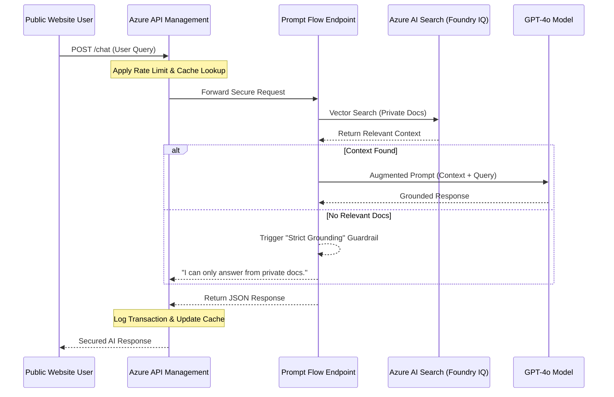

# 🤖 Secure Enterprise RAG Orchestrator

This repository contains the architecture and implementation for a production-grade RAG (Retrieval-Augmented Generation) pipeline using **Microsoft Foundry** and **Azure API Management (APIM)**.

## 📊 System Sequence Diagram
Below is the request flow from the public website to the secured AI backend.


# 🛠️ Deployment & Implementation Guide  
**Secure RAG Orchestrator (Azure / Microsoft Foundry)**

This guide outlines the end-to-end setup of the **Secure RAG Orchestrator**, covering infrastructure provisioning, Microsoft Foundry configuration, Zero-Trust IAM, Prompt Flow orchestration, and API Management integration.

---

## 1. Core Infrastructure Provisioning

Deploy the following base resources into a **single Azure Resource Group** for unified management and lifecycle control.

### Storage & Data
- Create an **Azure Storage Account**: `datastorageaccount`
- Create a **Blob Container**: `datastoragecontainer`
- Upload source documents (PDF, Word, etc.) used for RAG grounding

### Security
- Create an **Azure Key Vault**: `azure-ai-keyvault`
- Used for secret management and secure service integration

### Observability
- Deploy **Application Insights**
- Enables end-to-end telemetry, tracing, and diagnostics

---

## 2. Microsoft Foundry Setup

The AI backbone is built on the **Microsoft Foundry** ecosystem.

### Foundry Resource
- Deploy **Microsoft Foundry**: `azure-ai-foundry`

### Azure AI Hub
- Create **Azure AI Hub**: `azure-ai-hub`
- Connect:
  - Foundry resource
  - Azure Key Vault
  - Application Insights
- Enable **System-Assigned Managed Identity**

### Azure AI Hub Project
- Create an **AI Hub Project**: `azure-ai-hub-project`
- Link it to the AI Hub

### Model Deployment
Using the [Azure AI Foundry Portal](https://ai.azure.com), deploy using the below **model names**:

| Capability        | Model Name |
|------------------|-----------|
| Chat Completion  | `gpt-4o` (or preferred model) |
| Embeddings       | `text-embedding-ada-002` |

---

## 3. Knowledge Base (RAG) Configuration

Private data integration is handled via **Azure AI Search**.

### Azure AI Search
- Deploy **Azure AI Search**: `azure-ai-search`

### Data Ingestion
- Use the **Import Data** wizard
- Connect:
  - Azure Storage Account
  - AI Hub Project

### Optimization
- Enable **Semantic Ranker**
- Configure an indexing schedule for continuous data freshness

---

## 🔐 4. Identity & Access Management (IAM)

> **Critical:** This architecture follows the **Principle of Least Privilege (PoLP)** using **System-Assigned Managed Identities** only.

### Role Assignments

| Source Component | Target Resource | Role |
|-----------------|----------------|------|
| User Account | Resource Group | Azure AI Inference Deployment Operator |
| User Account | Azure AI Search | Search Index Data Reader / Contributor |
| AI Hub (Managed Identity) | Resource Group | Azure AI Administrator |
| Azure AI Search (Managed Identity) | Storage Account | Storage Blob Data Reader |
| Azure AI Search (Managed Identity) | Foundry Resource | Cognitive Services OpenAI User |
| Project Identity | Project Resource | Azure AI Administrator |

---

## 5. Prompt Flow Orchestration

### Connections
In the **Foundry Management Center**:
- Add **Azure AI Search** as a connection
- Use **Microsoft Entra ID authentication**

### Custom Connection
Create a custom connection named:

AzureAISearchConn


With the following variables:
- `AZURE_SEARCH_ENDPOINT`
- `AZURE_SEARCH_INDEX`
- `AZURE_SEARCH_KEY`

### Flow Deployment
- Upload Prompt Flow source code from this repository
- Validate DAG execution
- Ensure **Groundedness guardrails** are functioning
- Deploy the flow as an **Azure Machine Learning Online Endpoint**

---

## 6. API Management (APIM) Security Layer

To expose inference securely, the endpoint is fronted by **Azure API Management**.

### APIM Instance
- Deploy **Azure API Management**: `azure-ai-apim`
- Enable **System-Assigned Managed Identity**

### API Integration
- Create a new **HTTP API**
- Backend target:


https://*.inference.ml.azure.com


### Governance & IAM (Post APIM & ML Online Endpoint Deployment)

The following role assignments are required **after deploying the Azure Machine Learning Online Endpoint** to ensure secure access to Azure AI Search, Foundry, Hub, and Project resources.

| Source Component | Target Resource | Role |
|-----------------|----------------|------|
| Machine Learning Online Endpoint | Azure AI Search (`azure-ai-search`) | Search Index Data Reader |
| Machine Learning Online Endpoint | Azure AI Search (`azure-ai-search`) | Search Index Data Contributor |
| Azure API Management (`azure-ai-apim`) | Azure AI Search (`azure-ai-search`) | AzureML Data Scientist |
| Azure API Management (`azure-ai-apim`) | Azure AI Foundry (`azure-ai-foundry`) | AzureML Data Scientist |
| Azure API Management (`azure-ai-apim`) | Azure AI Hub (`azure-ai-hub`) | AzureML Data Scientist |
| Azure API Management (`azure-ai-apim`) | Azure AI Hub Project (`azure-ai-hub-project`) | AzureML Data Scientist |
| Azure API Management (`azure-ai-apim`) | Azure AI Hub Project (`azure-ai-hub-project`) | Azure Machine Learning Workspace Connection Secrets Reader |
| Machine Learning Online Endpoint | Azure AI Hub Project (`azure-ai-hub-project`) | Azure Machine Learning Workspace Connection Secrets Reader |
| Machine Learning Online Endpoint | Azure AI Hub Project (`azure-ai-hub-project`) | AzureML Metrics Writer (Preview) |


### Inbound Policies

The following **Azure API Management inbound policy** is applied at the **API level** to secure and govern access to the Prompt Flow inference endpoint.

This policy enforces:
- Rate limiting
- Response caching
- Backend routing to the Prompt Flow inference endpoint

Apply this policy in **APIM → APIs → <Your API> → Design → Inbound processing policy**.

```xml
<policies>
    <!-- Throttle, authorize, validate, cache, or transform the requests -->
    <inbound>
        <base />
        <authentication-managed-identity resource="https://ml.azure.com" />
        <!-- <set-header name="Authorization" exists-action="override"> -->
        <!--   <value>@("Bearer " + (string)context.Variables["msi-token"])</value> -->
        <!-- </set-header> -->
        <!-- 1. Caching Lookup: Check if this specific question was asked recently -->
        <cache-lookup vary-by-developer="false" vary-by-developer-groups="false" downstream-caching-type="none">
            <vary-by-header>Content-Type</vary-by-header>
            <vary-by-query-parameter>question</vary-by-query-parameter>
        </cache-lookup>
        <!-- 2. Rate Limiting: Prevent abuse if cache is missed -->
        <rate-limit-by-key calls="10" renewal-period="60" counter-key="@(context.Request.IpAddress)" />
        <!-- 3. Handshake: Inject Entra ID token to talk to your Prompt Flow -->
        <!-- 4. Routing: Ensure requests from your widget go to the Prompt Flow's /score path -->
        <rewrite-uri template="/score" copy-unmatched-params="true" />
        <!-- 4. Force Content-Type to JSON (Required by Prompt Flow) -->
        <set-header name="Content-Type" exists-action="override">
            <value>application/json</value>
        </set-header>
    </inbound>
    <!-- Control if and how the requests are forwarded to services  -->
    <backend>
        <base />
    </backend>
    <!-- Customize the responses -->
    <outbound>
        <base />
        <!-- 4. Save Response: Store the answer in cache for 1 hour to save costs -->
        <cache-store duration="3600" />
    </outbound>
    <!-- Handle exceptions and customize error responses  -->
    <on-error>
        <base />
        <choose>
            <!-- Check if the error was a 429 (Rate Limit) -->
            <when condition="@(context.Response.StatusCode == 429 || context.LastError.Reason == "RateLimitExceeded")">
                <set-status code="429" reason="Too Many Requests" />
                <set-header name="Content-Type" exists-action="override">
                    <value>application/json</value>
                </set-header>
                <!-- Use @{ return "..."; } to escape JSON braces -->
                <set-body>@{
                    return "{\"error\": \"Too many requests\"}";
                }</set-body>
            </when>
        </choose>
    </on-error>
</policies>
```
## ✅ Outcome

At the end of this setup, you will have:
- A **secure, zero-trust RAG pipeline**
- Enterprise-grade **identity-based access**
- **Grounded AI inference** via Prompt Flow
- **Governed public exposure** through API Management

## 💰 Cost Optimization & Governance

This architecture is designed to minimize LLM token consumption and infrastructure overhead through three specific layers:

1. **Strict Grounding (Prompt Level):** By implementing a "reject-fast" logic in the Jinja2 templates, queries that do not align with the retrieved documents are terminated early. This prevents the LLM from generating costly, out-of-scope "hallucinations."
2. **Semantic Caching (APIM Level):** Azure API Management is configured to cache frequent search queries. Repeat questions are served directly from the cache, resulting in **zero LLM token costs** and sub-millisecond response times for common user queries.
3. **Token Rate Limiting:** Managed via APIM policies to prevent "denial-of-wallet" attacks or automated abuse, ensuring the project stays within its monthly Azure credit allocation.
---

## 📎 References
- Azure AI Foundry: https://ai.azure.com  
- Azure Prompt Flow Documentation  
- Azure API Management Policies  
